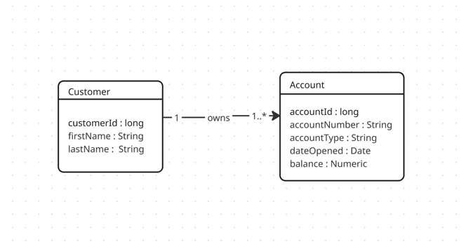

# Customer Account Management System (CAMS) CLI Application

This is a Java-based command-line interface (CLI) application for a banking system that manages customers and accounts, calculates liquidity positions, classifies accounts into tiers, and outputs data in JSON format.

---

## 📅 System Requirements & Runtime Tools

To build and run this application, you need the following tools:

*   **Java Development Kit (JDK):** Version **25** (OpenJDK 25 or newer is recommended and configured in the project).
*   **Build Tool:** **Apache Maven 3.9+** (or use the included Maven wrapper `./mvnw` / `mvn`).
*   **Operating System:** macOS, Linux, or Windows.

---

## 🚀 How to Build and Run

### 1. Build the Executable Artifact
The project is configured to use the `maven-shade-plugin` to compile and package the application into a single executable fat JAR file.

Run the following command in the project root directory:
```bash
mvn clean package
```
This generates the executable JAR in the `target/` directory:
*   `target/cams-cli-app-1.0-SNAPSHOT.jar`

### 2. Run the Application

The application supports both **Interactive Mode** and **Command-Line Arguments Mode**.

#### A. Interactive Mode (Menu-driven)
Run the executable JAR without arguments to start the interactive console:
```bash
java -jar target/cams-cli-app-1.0-SNAPSHOT.jar
```
This opens the menu-driven CLI:
```text
==================================================
     Customer Account Management System (CAMS)    
==================================================
1. Display All Accounts (Sorted by Balance Desc)
2. Display Platinum Tier Accounts Only
3. Exit
==================================================
Enter your choice (1-3): 
```

#### B. Command-Line Arguments Mode
You can query lists directly by passing commands to bypass the interactive menu:

*   **To display all accounts** (sorted by balance descending, with the bank's liquidity position at the bottom):
    ```bash
    java -jar target/cams-cli-app-1.0-SNAPSHOT.jar all
    ```
*   **To display only Platinum tier accounts**:
    ```bash
    java -jar target/cams-cli-app-1.0-SNAPSHOT.jar platinum
    ```

---

## 🎨 Domain Model Class Diagram

The system consists of two primary domain entities: `Customer` and `Account`. Below is the domain structure showing their fields and 1-to-many relationship:



*   **Customer:** Represents the account owner. A customer can own one or many accounts.
*   **Account:** Represents the financial account. Each account belongs to exactly one customer and is classified into a tier (Platinum, Gold, Silver) based on its balance.

---

## 🏗️ Solution Architecture & Detailed Design

The application is structured following the principles of **Separation of Concerns (SoC)**, **Strict Layering**, and **Domain-Driven Design (DDD)**.

### Architectural Blueprint
```mermaid
graph TD
    UI[CAMSApp Presentation / CLI Layer] --> Service[BankService Layer]
    Service --> Repo[BankRepository Layer]
    Repo --> Storage[(InMemory Data Storage)]
    
    subgraph Domain Model (DDD Entities)
        Customer[Customer Entity]
        Account[Account Entity]
        AccountTier[AccountTier Enum]
    end
    
    UI -.-> Domain
    Service -.-> Domain
    Repo -.-> Domain
```

### Detailed Design Layer breakdown:
1.  **Domain Layer (`cams.domain`)**:
    *   `Customer`: Represents the customer entity.
    *   `Account`: Represents the account entity. It calculates its own tier dynamically using `AccountTier`, illustrating DDD encapsulation.
    *   `AccountTier`: Enum detailing the bank's tiered relationship boundaries based on balance thresholds.
        *   **Platinum:** Balance $\ge$ $100,000.00
        *   **Gold:** $50,000.00 $\le$ Balance $<$ $100,000.00
        *   **Silver:** Balance $<$ $50,000.00
2.  **Data Access Layer / Repository (`cams.repository`)**:
    *   `BankRepository`: Defines database-agnostic contracts for retrieving banking details.
    *   `InMemoryBankRepository`: Implements the repository interface. Pre-loads and maintains the bank's sample data in-memory.
3.  **Service / Business Logic Layer (`cams.service`)**:
    *   `BankService`: Contains operations for business calculations (e.g. liquidity positions) and queries.
    *   `BankServiceImpl`: Implements the sorting of accounts by balance descending, calculates total liquidity, and filters Platinum tier accounts.
4.  **Presentation / Controller Layer (`cams.presentation` / `cams.CAMSApp`)**:
    *   `CAMSApp`: Orchestrates execution. Handles user console interactions, validates input, and outputs responses in pretty-printed JSON.

---

## 📊 Bank Seed Data
The application loads the following existing sample data on startup:

### Customers:
1.  **Bob Jones** (ID: 1)
2.  **Anna Smith** (ID: 2)
3.  **Carlos Jimenez** (ID: 3)

### Accounts:
1.  **AC1002** (Checking) - Owner: Bob Jones - Balance: `$155,900.50` (Tier: **Platinum**)
2.  **AS1003** (Savings) - Owner: Carlos Jimenez - Balance: `$75,000.00` (Tier: **Gold**)
3.  **AS1001** (Savings) - Owner: Bob Jones - Balance: `$12,500.95` (Tier: **Silver**)
4.  **AC1004** (Checking) - Owner: Anna Smith - Balance: `$11,700.99` (Tier: **Silver**)
